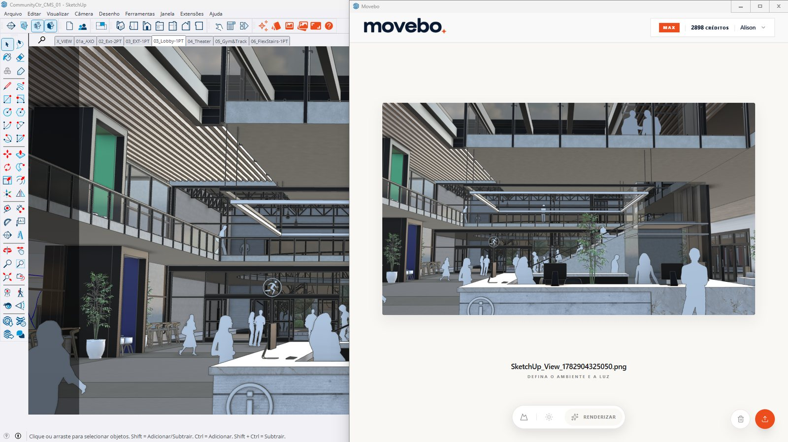
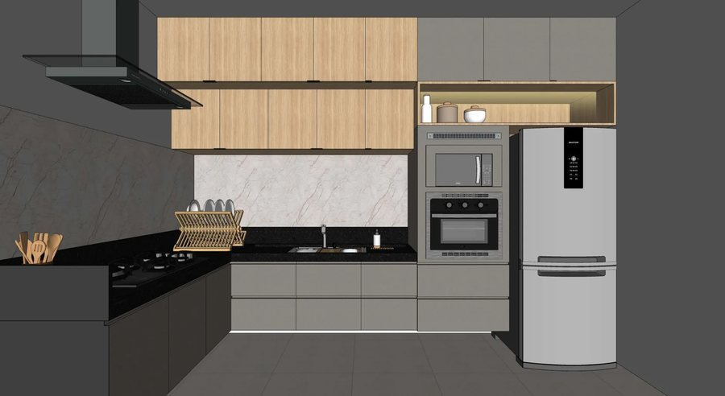
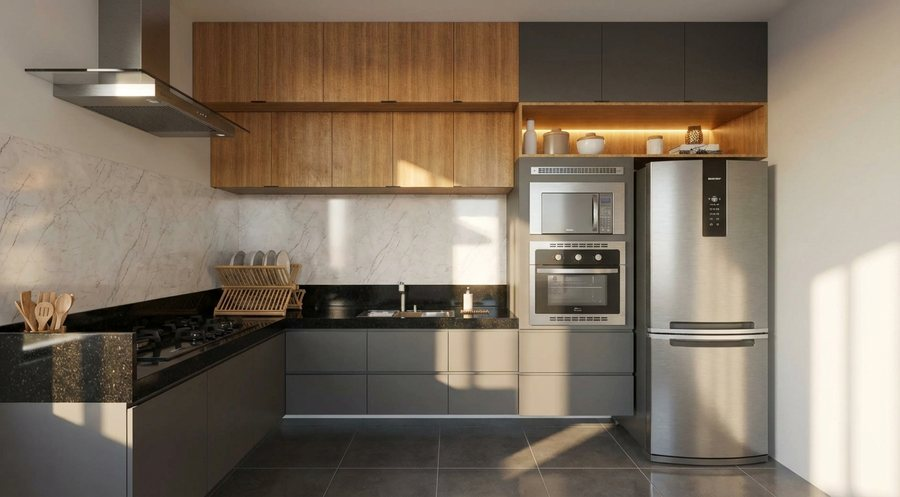
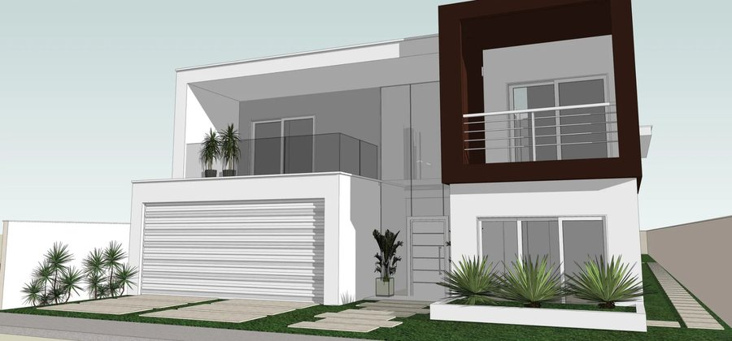
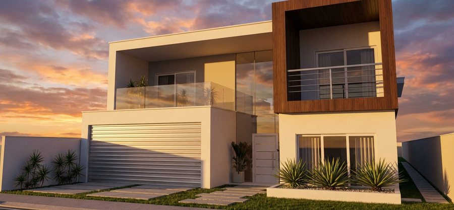
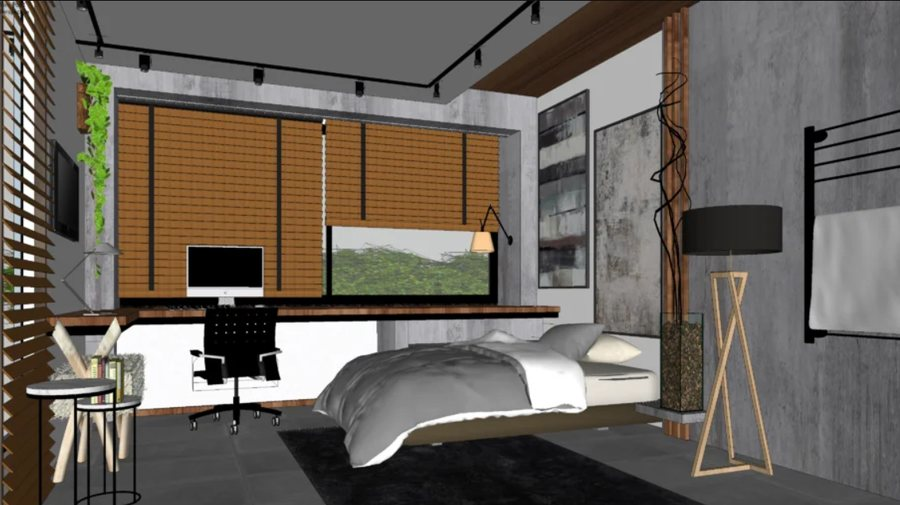
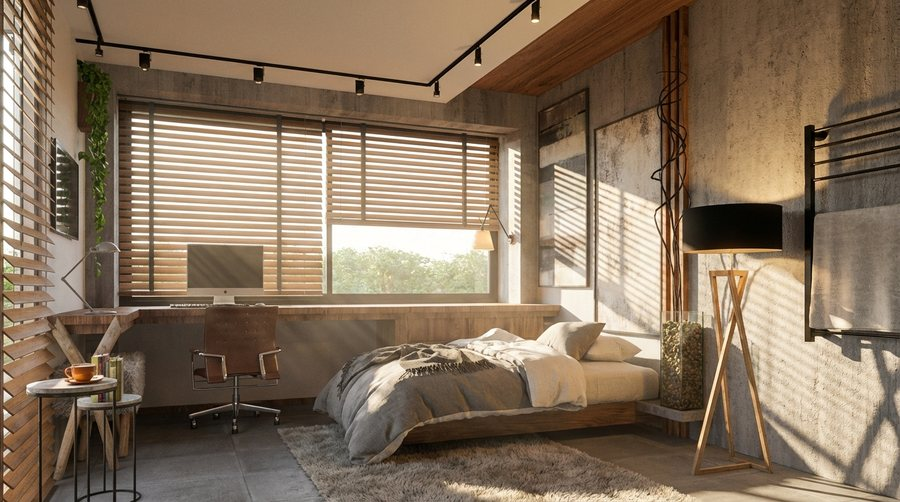

 

<picture>
  <source media="(prefers-color-scheme: dark)" srcset="assets/logo-dark.png">
  
</picture>

  

### Render com IA, direto do SketchUp.

Envie a cena da sua viewport e receba uma imagem fotorrealista em segundos — 
sem exportar, sem print, sem prompt complicado.

 

  

  

 

## Do modelo à imagem final

<table>
  <tr>
    <th width="50%">Viewport do SketchUp</th>
    <th width="50%">Render Movebo</th>
  </tr>
  <tr>
    <td></td>
    <td></td>
  </tr>
  <tr>
    <td></td>
    <td></td>
  </tr>
  <tr>
    <td></td>
    <td></td>
  </tr>
</table>

 

## O que vem na barra de ferramentas

| | |
|---|---|
| **Estúdio Movebo** | Abre o estúdio de render sem sair do SketchUp. |
| **Enviar vista** | Captura o enquadramento atual e manda direto para o render. |
| **Lote** | Envia várias cenas salvas de uma vez — ideal para apresentações. |
| **Formato** | Define a proporção da imagem final (1:1, 4:5, 9:16 ou 16:9). |
| **Estilo** | Aplica o estilo visual que dá a melhor leitura para a IA. |
| **Espelho** | Cria espelhos a partir da seleção, com reflexo pronto para o render. |
| **Luz IES · Fita de LED · Pintar Luz** | Iluminação de projeto: spots, perfis de LED e superfícies que emitem luz. |
| **Ajuda** | Guia completo de uso, dentro do próprio plugin. |

 

## Instalação em 1 minuto

1. **Baixe** o arquivo `moveborender.rbz` no botão acima.
2. No SketchUp, abra **Extensões › Gerenciador de extensões**.
3. Clique em **Instalar extensão** e selecione o `moveborender.rbz`.
4. Clique com o botão direito na área das barras de ferramentas e marque **Movebo**.
5. Abra o **Estúdio Movebo**, entre com sua conta e faça o primeiro render.

> [!TIP]
> Ainda não tem conta? Crie a sua em **[movebo.ai](https://movebo.ai/register)** — o mesmo login vale para o plugin e para o estúdio web.

 

## Atualizações

Toda versão nova sai em **[Releases](https://github.com/inovacao-totalcad/movebo.render.ai-download/releases)**.
O botão de download sempre aponta para a versão mais recente: para atualizar, baixe de novo e
instale por cima pelo Gerenciador de extensões.

 

---

  <a href="https://movebo.ai">movebo.ai</a>
  &nbsp;·&nbsp;
  Plugin oficial mantido pela <strong>TotalCAD</strong>
  &nbsp;·&nbsp;
  © 2026 TotalCAD. Todos os direitos reservados.

